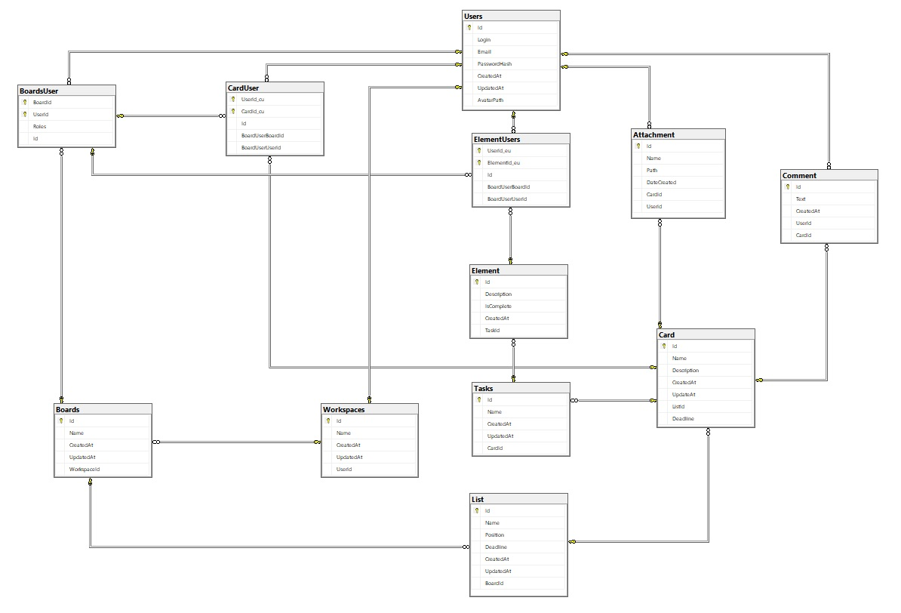

## WebAPI Project

Welcome to my API for kanban applications! This project provides a set of application programming interfaces (APIs)
that allow you to integrate your kanban application with other tools and access data inside your application.

## Technologies

* [ASP.NET Core 6](https://docs.microsoft.com/en-us/aspnet/core/release-notes/aspnetcore-6.0?view=aspnetcore-6.0)
* [Entity Framework Core](https://docs.microsoft.com/en-us/ef/core/)

## Features
* **Boards** - tasks grouped into projects, each is independent - has other 
users, list of cards and tasks
* **Board sharing** - ability to assign other users to the board. 
* **List of cards** - will allow to organize the content allowing easier categorization of
desired tasks. Each board has separate, independent card lists. Card lists can contain 
multiple cards.
* **Card** -will allow you to organize the chronology of tasks. Each card will consist of 
elements, will have its own independent list of users assigned to it from the 
common area of the board. The card will also have dates indicating the time for 
execution of all elements from a given card and attachments. Directly in the card will be
comments can be placed.
* **Elements** - components of the cards, which will symbolize task stages to which it will be possible to
directly assign users responsible for the stage and will have
an in-depth description of the problem.
* **Comments** - adding comments to individual cards, they are to enable 
communication between users.
* **Roles** - will allow you to manage permissions to the project. A member role allows you to 
adding entries and comments. The administrator role allows you to have total control over 
the project and the content of other users.
* **Description** - each component of the board will have a description to accurately describe the 
problem and approach.

[CHECK HOW IT WORKS (swagger documentation)](https://cabanoss.azurewebsites.net/swagger/index.html)

(further under construction/improvement)

